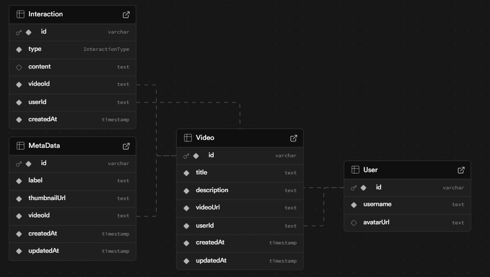

# Pie Intern Backend Assignment — Video API Documentation

This repository contains a REST API for managing videos, comments, likes, and interactions. It is built using Express.js, Prisma, and JWT authentication.

### Prerequisites

- Node.js
- PostgreSQL 
- `.env` file with the following environment variable: `DATABASE_URL`, `DIRECT_URL` (for migration), `JWT_SECRET`.
- Ensure Prisma is configured with your database.
- Run migrations to create necessary tables.
  
---

## ⚠️ Important

- **All endpoints (except `/auth`) require authentication via a JWT token.**
- Obtain the token by calling the `/auth` endpoint first.
- Pass the token in the `Authorization` header in the format:  
  `Authorization: Bearer <token>`
---

## Diagramatic representation of Database


## API Endpoints

### 1. `GET /auth`

- **Purpose:** Generate a JWT token for a dummy user.
- **Auth:** No
- **Request Body:** None
- **Response:**

```ts
type AuthResponse = {
  token: string; // JWT token with "Bearer " prefix
};
```

### 2. POST /videos
Purpose: Create a new video entry.
Auth: Required
Request Body:
```json

{
  "videoData": {
    "title": "string",
    "description": "string",
    "videoUrl": "string",
    "thumbnailUrl": "string (valid URL)",
    "label": "string"
  }
}
```
Response Body:

`Status: 200`
```js
{
 "video": {
    "id": string;
    "title": string;
    "description": string;
    "videoUrl": string;
    "userId": string;
    "metadata": {
      "thumbnailUrl": string;
      "label": string;
    };
  }
}
```
Errors:

`401 Unauthorized1` if no valid token.

`400 Bad Request` for missing/invalid video data.


### 3. `GET /videos`
 
Fetches paginated list of all videos.

Auth: Required

Query Parameters (optional):

- `page` (default: 1)

- `pageSize` (default: 20, max: 50)

Response:
```js
{
  videos: {
    id: string;
    title: string;
    description: string;
    createdAt: string; // ISO 8601 timestamp
    metadata: {
      thumbnailUrl: string;
      label: string;
    };
    user: {
      id: string;
      username: string;
      avatarUrl: string;
    };
  }[];
}
```
Errors:

- `401 Unauthorized` if no valid token.

---
## Additional Routes

### 4. GET /interactions/video/:id
Retrieves count of interactions (likes, views, comments) on a video.

Auth: Required

URL Params:

id: string ( Video ID)

Response:
```js
{
  stats: {
    likes: number;
    views: number;
    comments: number;
  };
}
```

 Errors:

- `401 Unauthorized` if no valid token.

- `400 Bad Request` if id is missing or invalid.

 ### 5. GET /comments/video/:id
Fetches paginated comments for a video.

Auth: Required

URL Params:

- `id: string` (Video ID)

Query Parameters (optional):

- page (default: 1)

- pageSize (default: 20, max: 50)

Response:
```js
{
  comment:{
    id: string;
    content: string;
    createdAt: string;
    user: {
      id: string;
      username: string;
      avatarUrl: string;
    };
  };
}
  ```

### 6. /like/video/:id 
like a video (each user can like a video once)
Auth: Required

URL Params:

- `id`: string (Video ID)

Response:
```js

{
  like: {
    type: "like";
    userId: string;
    videoId: string;
    createdAt: string;
  };
}
```
Errors:

- `401 Unauthorized` if no valid token.

- `400 Bad Request` if `id` is missing or invalid.

  ### 7. POST /comment/video/:id
Posts a comment on a video.

Auth: Required

URL Params:

- `id`: string ( Video ID)
Reqeust body:
```js
{
  "content": "string"
}
```
Response :
```js
{
  comment:{
    user: {
          id: string;
          username: string;
          avatarUrl: string | null;
      };
      id: string;
      createdAt: Date;
      content: string | null;
    }
  
};
```

Errors:

- `401 Unauthorized` if no valid token.

- `400 Bad Request` if id or content is missing or invali


